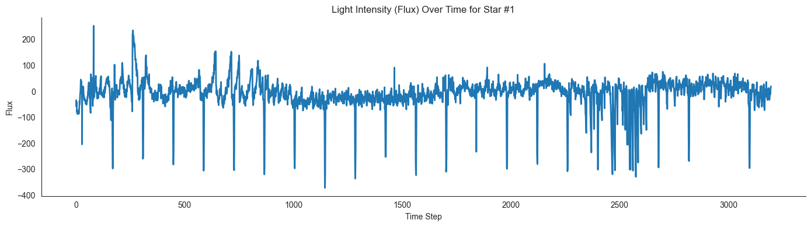

# Exoplanet Detection with Deep Learning - WIP


[![CraigDoesData][logo]][link]

[logo]: https://github.com/thecraigd/Python_SQL/raw/master/img/logo.png
[link]: https://www.craigdoesdata.com/

## Project Overview

This project attempts to apply deep learning techniques to detect exoplanets using light flux data from NASA's Kepler Space Telescope. The dataset contains time series data of stellar light intensity measurements, where periodic dips in brightness can indicate the presence of an orbiting exoplanet passing in front of its host star.

The primary goal is to build and train classification models that can accurately identify stars with orbiting exoplanets based on their light curve patterns.

<figure>
  
  <figcaption>Example light flux data from a star with signs of exoplanet transit</figcaption>
</figure>

## Dataset

The data comes from the [Kepler Labeled Time Series Data](https://www.kaggle.com/datasets/keplersmachines/kepler-labelled-time-series-data) on Kaggle and consists of:

- **exoTrain.csv**: 5,087 stellar light flux observations with 3,198 features (light flux measurements over time)
- **exoTest.csv**: 570 additional observations with the same feature structure

Each star is labeled with either:
- **2**: Confirmed exoplanet
- **1**: No confirmed exoplanet

## Methodology

This project implements a deep learning approach using the FastAI library, which provides high-level APIs built on PyTorch. The key steps include:

1. **Data loading and exploration**: Using Pandas to load and inspect the light flux time series data
2. **Visualization**: Plotting stellar light curves to identify the characteristic dips caused by exoplanet transits
3. **Model architecture**: Building and training neural network models for tabular data classification
4. **Evaluation**: Assessing model performance and parameter tuning

## Key Features

- Implementation of tabular neural networks with FastAI
- Visualization of light flux data to identify exoplanet transit signatures
- Data preprocessing and feature engineering for time series data
- Model optimization techniques

## Dependencies

- Python 3.x
- pandas
- fastai
- matplotlib
- seaborn
- torch
- numpy

## File Structure

```
.
├── exoTest.csv              # Test dataset
├── exoTrain.csv             # Training dataset 
├── kaggle_exoplanets.ipynb  # Main project notebook
├── models/                  # Saved model directory
├── naive_baseline.pkl       # Baseline model
├── pos_weight_baseline.pkl  # Weighted baseline model
└── README.md                # Project documentation
```

## Usage

1. Clone the repository
2. Ensure all dependencies are installed
3. Run the Jupyter notebook `kaggle_exoplanets.ipynb` to see the full analysis and model implementations

## Results

The project attempts to demonstrate how deep learning can be applied to astronomical data for exoplanet detection. 

The models developed thus far have some problems identifying the subtle patterns of exoplanet transits in light flux measurements. The major over-representation of stars with no exoplanet transits relative to stars with exoplanet transits means that the model as developed has effectively learned to say that every star has no exoplanet. This works well, leading to high accuracy and gets the loss function to a very low value.

## Future Work

- Attempt different techniques to overcome the unevenly weighted dataset
- Experiment with different neural network architectures
- Implement feature selection to reduce dimensionality
- Apply data augmentation techniques
- Test transfer learning approaches
- Incorporate additional astronomical metadata for improved predictions

## References

- [Kepler Space Telescope](https://www.nasa.gov/mission_pages/kepler/main/index.html)
- [Mikulski Archive for Space Telescopes](https://archive.stsci.edu/missions-and-data/k2)
- [FastAI Course](https://course.fast.ai/)
- [Kaggle Dataset](https://www.kaggle.com/datasets/keplersmachines/kepler-labelled-time-series-data)

## License

This project is open source and available under standard open source licenses.

## Acknowledgements

The data used in this project comes from NASA's Kepler mission, and was accessed through the Mikulski Archive maintained by the Space Telescope Science Institute (STScI).
